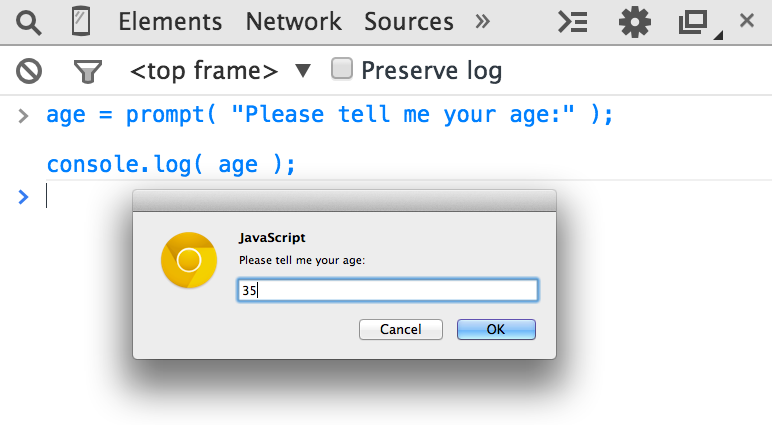

# You Don't Know JS: Up & Going
# 第一章: Into Programming

欢迎来到 *You Dont't Know JS* (*YDKJS*) 系列。

*Up & Going* 是对一些基本编程概念的介绍--当然我们特别倾向于JavaScript(经常被简称为JS)--以及如何慢慢接触并理解该系列丛书其他标题的意思。尤其如果你刚刚开始编程或者学习JavaScript，这本书将会简要地探索你接下来需要学的东西。

本书从站在一个很高的层次解释编程的基本原则开始，并假设你在阅读本书之前几乎没有编程经验，希望这些书来帮助你在一条的正确的道路上通过JavaScript来理解编程。

第一章是你将要深入学习的知识的一个快速预览以及迈向编程大门的实践。当然还有许多其他有意思的编程介绍资源可以帮助你更深入地挖掘该主题，我鼓励你在本章的基础上额外地去学习它们。

一旦你熟悉了编程基础，第二章将会指导你熟悉JavaScript的编程特点。第二章介绍了JavaScript是什么，但是再一次提醒你，第二章不是完全指导手册--完全的说明是 *YDKJS* 系列丛书剩余书籍的事情！
如果你早就对JavaScript很熟悉，那么请首先简单检查一下第三章，第三章说明了 *YDKJS* 要研究的东西，然后开始学习！

## 代码

让我们从头开始。

一个程序，通常指的是 *源码* 或仅仅是 *代码* ，是一组告诉计算机去执行什么任务的指令的集合。通常代码保存在文本文件中，虽然你可以直接在浏览器的开发者控制台(develop console)中写代码，这将在后面马上介绍到。

### 声明

在计算机语言中，一组单词、数字和操作符组成的特殊任务就是 *声明* 。在JavaScript中，一个声明看起来可能和下面类似：

```js
a = b * 2;
```

The characters `a` and `b` are called *variables* (see "Variables"), which are like simple boxes you can store any of your stuff in. In programs, variables hold values (like the number `42`) to be used by the program. Think of them as symbolic placeholders for the values themselves.

字符 `a` 和 变量`b` 被称为 *变量* (见"变量")，它们就像简单的箱子可以在里面存放你的东西。在程序中，变量存放被程序使用的值(比如 数字`42`)。可以认为它们就是**值**的**符号占位符**。

By contrast, the `2` is just a value itself, called a *literal value*, because it stands alone without being stored in a variable.

与此形成对比的是，`2`仅仅是指**值**本身，被称为 *字面值* ，因为`2`是单独的没有被存放在一个变量中。

The `=` and `*` characters are *operators* (see "Operators") -- they perform actions with the values and variables such as assignment and mathematic multiplication.

`=`和`*`字符是 *操作符* (见"操作符") -- 它们对值和变量执行操作，比如赋值和算术乘法。

Most statements in JavaScript conclude with a semicolon (`;`) at the end.

在 JavaScript 中大多数声明由分号(`;`)结尾。

The statement `a = b * 2;` tells the computer, roughly, to get the current value stored in the variable `b`, multiply that value by `2`, then store the result back into another variable we call `a`.

声明 `a = b * 2` 大概告诉计算机去取变量`b`的当前值，乘以数值`2`，然后将结果存于另外一个变量，我们称之为 `a`。

Programs are just collections of many such statements, which together describe all the steps that it takes to perform your program's purpose.

程序就是许多这种声明的集合，这些集合一起描述了程序如何一步步实现你的目标想法。

### 表达式

Statements are made up of one or more *expressions*. An expression is any reference to a variable or value, or a set of variable(s) and value(s) combined with operators.

声明由一个或多个 *表达式* 组成。一个表达式就是任意一个变量或值的引用，或者是一组用操作符连接起来的变量(一个或多个)和值(一个或多个)。

For example:

例如: 

```js
a = b * 2;
```

This statement has four expressions in it:

这个声明包含了4个表达式:

* `2` is a *literal value expression*
* `2` 是 *字面值表达式*
* `b` is a *variable expression*, which means to retrieve its current value
* `b` 是 *变量表达式* ，表示的是取得它的当前值
* `b * 2` is an *arithmetic expression*, which means to do the multiplication
* `b * 2` 是 *算术表达式* ，表示的是乘法
* `a = b * 2` is an *assignment expression*, which means to assign the result of the `b * 2` expression to the variable `a` (more on assignments later)
* `a = b * 2` 是 *赋值表达式* ，表示的是将 `b * 2` 表达式的结果赋值给变量 `a` (后面会详细介绍赋值)

A general expression that stands alone is also called an *expression statement*, such as the following:

一个单独存在的普通表达式也称为 *表达式声明* ，如下所示:

```js
b * 2;
```

This flavor of expression statement is not very common or useful, as generally it wouldn't have any effect on the running of the program -- it would retrieve the value of `b` and multiply it by `2`, but then wouldn't do anything with that result.

这种风格的表达式声明不是非常常见和有用，因为通常它对正在运行的程序不会有任何影响 -- 它会从 `b` 中获取值然后乘以 `2`，但是对结果却什么也没做。

A more common expression statement is a *call expression* statement (see "Functions"), as the entire statement is the function call expression itself:

另外一种常见的表达式声明是 *调用表达式(call expression)* 声明(见"函数")，因为整个声明本身就是一个函数调用表达式:

```js
alert( a );
```

### Executing a Program
### 运行一个程序

How do those collections of programming statements tell the computer what to do? The program needs to be *executed*, also referred to as *running the program*.

这些程序声明的集合是怎么样告诉电脑去做什么的？程序需要被 *执行* ，也就是 *运行程序* 。

Statements like `a = b * 2` are helpful for developers when reading and writing, but are not actually in a form the computer can directly understand. So a special utility on the computer (either an *interpreter* or a *compiler*) is used to translate the code you write into commands a computer can understand.

譬如 `a = b * 2` 这样的声明对于开发者阅读和编写代码是很有帮助的，但是这不是计算机可以直接理解的格式。所以计算机上有专门的工具(*解释器* 或 *编译器*)用来将你写的代码翻译成计算机可以理解的命令。

For some computer languages, this translation of commands is typically done from top to bottom, line by line, every time the program is run, which is usually called *interpreting* the code.

对于一些计算机语言，每一次程序运行时总是从头到尾一行一行的将代码翻译成机器命令，这样的模式通常被称为 *解释(interpreting)* 代码。

For other languages, the translation is done ahead of time, called *compiling* the code, so when the program *runs* later, what's running is actually the already compiled computer instructions ready to go.

对于另外一些语言，代码的翻译工作是提前做好的，这样的模式被称为 *编译(compiling)* ，所以当程序稍后 *运行* 时，真正运行的实际上是已经编译好的计算机指令。

It's typically asserted that JavaScript is *interpreted*, because your JavaScript source code is processed each time it's run. But that's not entirely accurate. The JavaScript engine actually *compiles* the program on the fly and then immediately runs the compiled code.

通常来说， JavaScript 被认作是 *解释(interpreted)* 型语言，因为每次运行时你的 JavaScript 源代码会被解释处理。但这并无完全准确。JavaScript 引擎实际上飞速地 *编译* 程序然后立即执行编译好的代码。

**Note:** For more information on JavaScript compiling, see the first two chapters of the *Scope & Closures* title of this series.

**笔记:** 想要了解更多有关 JavaScript 编译的资料，参考本系列的第二章 *Scope & Closures* 。

## Try It Yourself
## 亲自尝试

This chapter is going to introduce each programming concept with simple snippets of code, all written in JavaScript (obviously!).

这一章节准备通过简单的代码片段来介绍每一个编程概念，所有的代码片段当然都由 JavaScript 来编写。

It cannot be emphasized enough: while you go through this chapter -- and you may need to spend the time to go over it several times -- you should practice each of these concepts by typing the code yourself. The easiest way to do that is to open up the developer tools console in your nearest browser (Firefox, Chrome, IE, etc.).

下面内容着重强调: 当你阅读这一章节时 -- 你也许需要花一些时间去阅读好几遍 -- 你应该亲自敲下这些代码来练习这里面的每一个概念。最简单的方法就是打开你最近使用的浏览器(Firefox, Chrome, IE 等等)的开发者工具控制台(developer tools console)。

**Tip:** Typically, you can launch the developer console with a keyboard shortcut or from a menu item. For more detailed information about launching and using the console in your favorite browser, see "Mastering The Developer Tools Console" (http://blog.teamtreehouse.com/mastering-developer-tools-console). To type multiple lines into the console at once, use `<shift> + <enter>` to move to the next new line. Once you hit `<enter>` by itself, the console will run everything you've just typed.

**提示** 通常来说，你可以通过键盘快捷键或者从菜单选项中打开你的开发者工具控制台。获取更多有关打开和使用你最喜欢的浏览器的控制台的细节，请参考"掌控开发者工具控制台(Mastering The Developer Tools Console)"  
(http://blog.teamtreehouse.com/mastering-developer-tools-console)
在控制台中一次输入多行，使用 `<shift> + <enter>` 来移动到下一行。一旦你敲下 `<enter>` ，控制台将会运行所有你敲下的代码。

Let's get familiar with the process of running code in the console. First, I suggest opening up an empty tab in your browser. I prefer to do this by typing `about:blank` into the address bar. Then, make sure your developer console is open, as we just mentioned.

让我们来熟悉在控制台中运行代码的过程。  
首先，我建议你在浏览器中打开一个空标签页。我推荐你在地址栏输入 `about:blank` 。然后，确保你的开发者控制台已经打开，正如我们刚才(上面)提到的那样。

Now, type this code and see how it runs:

现在，敲下代码然后观察它是如何运行的:

```js
a = 21;

b = a * 2;

console.log( b );
```

Typing the preceding code into the console in Chrome should produce something like the following:

在 Chrome 中敲下上面的代码应该会得到类似下面的结果:


Go on, try it. The best way to learn programming is to start coding!

继续尝试。学习编程最好的方法就是开始敲代码!

### Output
### 输出

In the previous code snippet, we used `console.log(..)`. Briefly, let's look at what that line of code is all about.

在前面的代码片段中，我们使用了 `console.log(..)` 。下面让我们简单地来看看这几行代码都说了些什么。

You may have guessed, but that's exactly how we print text (aka *output* to the user) in the developer console. There are two characteristics of that statement that we should explain.

你可能已经猜到了，这正是我们在开发者控制台中打印文本的方法(也称为 *输出到用户(output)*)。在这个声明中有两个特点需要我们解释。

First, the `log( b )` part is referred to as a function call (see "Functions"). What's happening is we're handing the `b` variable to that function, which asks it to take the value of `b` and print it to the console.

首先，`log( b )`部分作为一个函数调用(见 "函数")。我们将变量`b`交给函数，函数拿到`b`的值并且打印到控制台，这就是发生的事情。

Second, the `console.` part is an object reference where the `log(..)` function is located. We cover objects and their properties in more detail in Chapter 2.

第二，`console.`部分是一个对象引用，后面跟着`log(..)`函数。在第二章(Chapter 2)我们将会对 **对象** 和 **对象的属性** 有更加细节的描述。

Another way of creating output that you can see is to run an `alert(..)` statement. For example:

另外一个创造输出的方法正如你所见就是运行 `alert(..)` 声明。  
例如:

```js
alert( b );
```

If you run that, you'll notice that instead of printing the output to the console, it shows a popup "OK" box with the contents of the `b` variable. However, using `console.log(..)` is generally going to make learning about coding and running your programs in the console easier than using `alert(..)`, because you can output many values at once without interrupting the browser interface.

如果你运行它，你将会注意到它显示了一个"OK"弹出框并且弹出框的内容是变量 `b` 而不是打印输出到控制台。然而，使用 `console.log(..)` 是一个让你学习在控制台中写代码和运行程序更简单的方式，而不是使用 `alert(..)` ，因为你可以一次性输出很多值而不用中断浏览器界面。

For this book, we'll use `console.log(..)` for output.

在本书中，我们将会使用 `conosole.log(..)` 来输出。

### Input
### 输入

While we're discussing output, you may also wonder about *input* (i.e., receiving information from the user).

当我们讨论输出的时候，你也许也想知道 *输入* (例如，从用户那里收到消息)。

The most common way that happens is for the HTML page to show form elements (like text boxes) to a user that they can type into, and then using JS to read those values into your program's variables.

最常见的场景就是一个 HTML 页面显示表单元素(比如文本复选框 text boxes)，用户可以键入内容，然后使用 JS 来读取值到你的程序变量中。

But there's an easier way to get input for simple learning and demonstration purposes such as what you'll be doing throughout this book. Use the `prompt(..)` function:

但是这里有一个更简单的方法用于简单的学习以及示范的目的正如在这本书中使用的一样。使用 `prompt(..)` 函数:

```js
age = prompt( "Please tell me your age:" );

console.log( age );
```

As you may have guessed, the message you pass to `prompt(..)` -- in this case, `"Please tell me your age:"` -- is printed into the popup.

正如你可能已经猜到的一样，你传递给 `prompt(..)` 函数的消息 -- 在本例中，是 `"Please tell me your age"` -- 将会被弹出显示。

This should look similar to the following:

这应该和下面的类似:



Once you submit the input text by clicking "OK," you'll observe that the value you typed is stored in the `age` variable, which we then *output* with `console.log(..)`:

一旦你通过点击"OK"提交了输入的文本，你将会发现你输入的值被存储在 `age` 变量中，我们用 `console.log(..)` *输出 output* 该变量:  


To keep things simple while we're learning basic programming concepts, the examples in this book will not require input. But now that you've seen how to use `prompt(..)`, if you want to challenge yourself you can try to use input in your explorations of the examples.

为了使学习基本编程概念变得更加轻松，本书的示例将不会要求有输入。但是现在你已经见到如何使用 `prompt(..)` ，如果你想挑战你自己，你可以尝试着在你的示例探索中使用输入。

## Operators
## 操作符

Operators are how we perform actions on variables and values. We've already seen two JavaScript operators, the `=` and the `*`.

操作符用来定义变量和值如何执行动作。我们已经见过两个 JavaScript 操作符，分别是 `=` 和 `*`。

The `*` operator performs mathematic multiplication. Simple enough, right?

`*` 操作符用来执行算法乘法。简单至极，对吧？

The `=` equals operator is used for *assignment* -- we first calculate the value on the *right-hand side* (source value) of the `=` and then put it into the variable that we specify on the *left-hand side* (target variable).

`=` 相等操作符被用来 *赋值* -- 我们首先计算 `=` *右手边的 right-hand side* (源 *值*) 然后将其放到我们指定的 `=` *右手边的* 变量(目标 **变量**)里。

**Warning:** This may seem like a strange reverse order to specify assignment. Instead of `a = 42`, some might prefer to flip the order so the source value is on the left and the target variable is on the right, like `42 -> a` (this is not valid JavaScript!). Unfortunately, the `a = 42` ordered form, and similar variations, is quite prevalent in modern programming languages. If it feels unnatural, just spend some time rehearsing that ordering in your mind to get accustomed to it.

**警告:** 赋值的顺序看起来有点奇怪且相反。不仅仅是 `a = 42` ，有些甚至喜欢翻转顺序所以源值在左边，目标变量在右边，例如 `42 -> a` (这在 JavaScript 中不合法)。不幸的是，`a = 42` 这样的顺序格式，还有类似的一些变化形式，在现代编程语言中非常流行。如果这让你感觉不自然，多花时间在你的心里记住这样的顺序并且去习惯它。

Consider:

思考:

```js
a = 2;
b = a + 1;
```

Here, we assign the `2` value to the `a` variable. Then, we get the value of the `a` variable (still `2`), add `1` to it resulting in the value `3`, then store that value in the `b` variable.

在这里，我们将 值 `2` 赋给 变量 `a` 。然后，我们用 变量 `a` 的值(仍然是 `2`)加上 `1` 返回结果为 值 `3` ，再把这个值 `3` 存储到 变量 `b` 中。

While not technically an operator, you'll need the keyword `var` in every program, as it's the primary way you *declare* (aka *create*) *var*iables (see "Variables").

从严格意义上来说这不是一个操作符，但是你将会需要关键字 `var` 在每一个程序中，因为它是 *声明 declare* (也称为 *创造 creat*) 变量(*var*iables) (见 "变量 Variables")。

You should always declare the variable by name before you use it. But you only need to declare a variable once for each *scope* (see "Scope"); it can be used as many times after that as needed. For example:

你应该总是在你使用变量之前先用名字来声明一个变量。但是你仅仅需要在一个 *范围 scope* 内定义这个变量一次(见 "范围 scope")；变量将在声明之后可以根据需要想使用就多少次就使用多少次。例如:

```js
var a = 20;

a = a + 1;
a = a * 2;

console.log( a );	// 42
```

Here are some of the most common operators in JavaScript:

这里是一些在 JavaScript 中常用的操作符:

* Assignment: `=` as in `a = 2`.
* 赋值: 正如 `=` 在 `a =2 ` 中。
* Math: `+` (addition), `-` (subtraction), `*` (multiplication), and `/` (division), as in `a * 3`.
* 数学: `+` (加 addition)， `-` (减 subtraction)， `*` (乘 multiplication) 和 `/` (除 division)，正如在 `a * 3` 中。
* Compound Assignment: `+=`, `-=`, `*=`, and `/=` are compound operators that combine a math operation with assignment, as in `a += 2` (same as `a = a + 2`).
* 组合赋值符: `+=`，`-=`，`*=` 和 `/=` 是组合赋值符，组合赋值符将数学运算和赋值组合在一起，例如 `a += 2` (就是 `a = a + 2`)。
* Increment/Decrement: `++` (increment), `--` (decrement), as in `a++` (similar to `a = a + 1`).
* 自增/自减: `++` (自增), `--` (自减)，例如 `a++` (就是 `a = a+ 1`)。
* Object Property Access: `.` as in `console.log()`.
* 对象属性访问符: 正如 `console.log()` 中的 `.` 。

   Objects are values that hold other values at specific named locations called properties. `obj.a` means an object value called `obj` with a property of the name `a`. Properties can alternatively be accessed as `obj["a"]`. See Chapter 2.
   对象由被称为属性的值组成。 `obj.a` 是说一个对象 `obj` 有一个属性 `a`。属性也可以通过 `obj[a]` 这种方式来访问。参考第二章。
* Equality: `==` (loose-equals), `===` (strict-equals), `!=` (loose not-equals), `!==` (strict not-equals), as in `a == b`.
* 相等: `==` (弱等)， `===` (强等)， `!=` (弱不等)，`!==` (强不等)，例如 `a == b` 。

   See "Values & Types" and Chapter 2.
   参考第二章 "Values & Types"。
* Comparison: `<` (less than), `>` (greater than), `<=` (less than or loose-equals), `>=` (greater than or loose-equals), as in `a <= b`.
* 比较运算符: `<` (小于)，`>` (大于)，`<=` (小于或弱等于)，`>=` (大于或若等于)，例如 `a <= b` 。

   See "Values & Types" and Chapter 2.
   参考 "Values & Types" 。
* Logical: `&&` (and), `||` (or), as in `a || b` that selects either `a` *or* `b`.
* 逻辑运算符: `&&` (和)， `||` (或)，正如 `a || b` ，要么选择 `a` 要么选择 `b` 。

   These operators are used to express compound conditionals (see "Conditionals"), like if either `a` *or* `b` is true.
   
   这些操作符在复合环境中被使用(参考 "条件")，正如判断 `a` 和 `b` 哪个是真的。

**Note:** For much more detail, and coverage of operators not mentioned here, see the Mozilla Developer Network (MDN)'s "Expressions and Operators" (https://developer.mozilla.org/en-US/docs/Web/JavaScript/Guide/Expressions_and_Operators).

**Note** 想要获取更多的细节，详细介绍上文还没提到过的操作符，参考 Mozilla Developer Network (MDN)'s "Expressions and Operators" (https://developer.mozilla.org/en-US/docs/Web/JavaScript/Guide/Expressions_and_Operators).

## Values & Types
## 值 和 类型

If you ask an employee at a phone store how much a certain phone costs, and they say "ninety-nine, ninety-nine" (i.e., $99.99), they're giving you an actual numeric dollar figure that represents what you'll need to pay (plus taxes) to buy it. If you want to buy two of those phones, you can easily do the mental math to double that value to get $199.98 for your base cost.

如果你去一家手机店询问店一款手机的价格，他们会告诉你是99.99美元，他们告诉你的是一个代表着你买这个手机需要支付的含税的具体美元数值。如果你想买两个这种手机，你可以在基础价格上通过简单的脑力计算将99美元乘以2得到198美元。

If that same employee picks up another similar phone but says it's "free" (perhaps with air quotes), they're not giving you a number, but instead another kind of representation of your expected cost ($0.00) -- the word "free."

如果这个电源拿起另一款手机但是说这款手机是"免费(free)"的(perhaps with air quotes)，他没有给你一个具体的数字，而是给了另一个类型来表示你的预期花费(0.00美元) -- 单词 "免费"。

When you later ask if the phone includes a charger, that answer could only have been either "yes" or "no."

当你稍后问说这款手机有没有配充电器，答案只能是"是"或者"否"。

In very similar ways, when you express values in a program, you choose different representations for those values based on what you plan to do with them.

类似的，当你在程序中表示一个值时，你根据值的用途来选择不同的类型来表示这些值。

These different representations for values are called *types* in programming terminology. JavaScript has built-in types for each of these so called *primitive* values:

这些值的不同表示在程序术语中被称为 *类型* 。JavaScript 有内建的类型称为 "原生(基本)" 类型:

* When you need to do math, you want a `number`.
* 当你需要做算术运算，你需要 `number` 。
* When you need to print a value on the screen, you need a `string` (one or more characters, words, sentences).
* 当你需要在屏幕上打印值的时候，你需要 `string` (一个或多个字符、单词或句子)。
* When you need to make a decision in your program, you need a `boolean` (`true` or `false`).
* 当你需要在你的程序中做决定时，你需要一个 `boolean` (`true`或者`false`)。

Values that are included directly in the source code are called *literals*. `string` literals are surrounded by double quotes `"..."` or single quotes (`'...'`) -- the only difference is stylistic preference. `number` and `boolean` literals are just presented as is (i.e., `42`, `true`, etc.).

那些被直接写在原代码中的值被称为 *字面值(literals)* 。`string` 是用双引号 `"..."` 或 单引号 `'...'` 引起来的字面值 -- 它们唯一的区别只是风格不同。 `number` 和 `boolean` 字面值就是它们本身(例如，`43`，`true`等)。

Consider:

思考:

```js
"I am a string";
'I am also a string';

42;

true;
false;
```

Beyond `string`/`number`/`boolean` value types, it's common for programming languages to provide *arrays*, *objects*, *functions*, and more. We'll cover much more about values and types throughout this chapter and the next.

上面的 `string` / `number` / `boolean` 值类型在编程语言那种常用来创建 *arrays*，*objects*，*functions*以及其他复杂类型。我们将会在本章接下来的内容中更多的介绍值和类型。

### Converting Between Types
### 类型转换

If you have a `number` but need to print it on the screen, you need to convert the value to a `string`, and in JavaScript this conversion is called "coercion." Similarly, if someone enters a series of numeric characters into a form on an ecommerce page, that's a `string`, but if you need to then use that value to do math operations, you need to *coerce* it to a `number`.

如果你有一个 `number` 但是想将它打印在屏幕上，你需要将这个值转换成 `string` 类型，在 JavaScript 中这样的转换被称为 "强制转换 coercion"。类似地，如果有人在电子商务页面输入了一组数字字符，它是 `string` 类型的，但是如果你需要使用它来做数学操作，你需要 *强制转换* 成 `number` 类型。

JavaScript provides several different facilities for forcibly coercing between *types*. For example:

JavaScript 提供了几个不同的方法来强制转换 *类型* 。例如:

```js
var a = "42";
var b = Number( a );

console.log( a );	// "42"
console.log( b );	// 42
```

Using `Number(..)` (a built-in function) as shown is an *explicit* coercion from any other type to the `number` type. That should be pretty straightforward.

使用上面所示的 `Number(..)` (一个内置的函数) 明确地从其他任何类型转换成 `number` 类型。这很直观而且直接。

But a controversial topic is what happens when you try to compare two values that are not already of the same type, which would require *implicit* coercion.

但是有争议的主题是，当你尝试去比较两个不是同一类型的值，这会导致 *隐式的 implicit* 强制类型转换，会发生什么呢?

When comparing the string `"99.99"` to the number `99.99`, most people would agree they are equivalent. But they're not exactly the same, are they? It's the same value in two different representations, two different *types*. You could say they're "loosely equal," couldn't you?

当比较 string `"99.99"` 和 number `99.99` 时，大部分人将会认为它们是相等的。但是实际上它们并不完全相等，不是吗？同一个值的两种不同的表示方法，两种不同的 *类型* 。你可以说它们是 "弱相等 loosely equal" ，不是吗？

To help you out in these common situations, JavaScript will sometimes kick in and *implicitly* coerce values to the matching types.

为了帮助你从这样模棱两可的情况中脱离出来，JavaScript 将会 *隐式的* 强制类型转换将值转换成匹配的类型。

So if you use the `==` loose equals operator to make the comparison `"99.99" == 99.99`, JavaScript will convert the left-hand side `"99.99"` to its `number` equivalent `99.99`. The comparison then becomes `99.99 == 99.99`, which is of course `true`.

所以当你使用 `==` 弱相等比较符来比较 `"99.99" == 99.99` ，JavaScript 将会将左边的值 `"99.99"` 转换成它相等的 `number` 类型 `99.99` 。比较编程了 `99.99 == 99.99` ，答案当然为 `true` 。

While designed to help you, implicit coercion can create confusion if you haven't taken the time to learn the rules that govern its behavior. Most JS developers never have, so the common feeling is that implicit coercion is confusing and harms programs with unexpected bugs, and should thus be avoided. It's even sometimes called a flaw in the design of the language.

虽然隐式转换的设计初衷是为了帮助你，但是隐式的强制类型转换会产生一些疑惑当你没有花时间去研究过转换的具体行为。大多数的 JS 开发者从来没有花过时间在这上面，所以给人通常的感受是隐式强制类型转换很混乱并且危害程序使程序有不可预知的bugs，所以应该避免隐式类型转换。有时隐式类型转换甚至被认为是语言设计的缺点。

However, implicit coercion is a mechanism that *can be learned*, and moreover *should be learned* by anyone wishing to take JavaScript programming seriously. Not only is it not confusing once you learn the rules, it can actually make your programs better! The effort is well worth it.

然而，隐式强制类型转换时一种 *可以被学习* 的机制，而且 *应该被学习* 被每一个想要真正认真学习 JavaScript 编程的人。不仅因为一旦你学会了隐式转换的规则之后不会感到疑惑，而且它实际上会使你的程序更加优秀！它带来的影响值得它被好好学习。

**Note:** For more information on coercion, see Chapter 2 of this title and Chapter 4 of the *Types & Grammar* title of this series.

**注意** 想获取更多有关强制类型转换(coercion)的消息，可以查看本书的第二章以及 *Types & Grammar* 这本书的第四章。

## Code Comments
## 代码注释

The phone store employee might jot down some notes on the features of a newly released phone or on the new plans her company offers. These notes are only for the employee -- they're not for customers to read. Nevertheless, these notes help the employee do her job better by documenting the hows and whys of what she should tell customers.

手机店的员工也许会草草记下最近新出的手机的新特性或者是她所在的公司提供的最新计划。这些笔记仅仅是为了员工自己 -- 它们不是为了顾客去阅读的。然而，这些笔记通过记录店员应该如何和为何与顾客交谈来帮助店员更好地去完成她的工作。

One of the most important lessons you can learn about writing code is that it's not just for the computer. Code is every bit as much, if not more, for the developer as it is for the compiler.

一个非常重要的课你可以学到的是编写代码从来不只是为了计算机。代码不仅仅是为了编译器而写，也同样是为了开发者而写。

Your computer only cares about machine code, a series of binary 0s and 1s, that comes from *compilation*. There's a nearly infinite number of programs you could write that yield the same series of 0s and 1s. The choices you make about how to write your program matter -- not only to you, but to your other team members and even to your future self.

你的电脑只关心机器代码，那是一串的二进制0、1串，由 *编译 compilation* 而来。你可以在程序中写几乎无限多的0、1串。你选择如何更好地编写你的程序 -- 不仅仅是为了你， 也为了你小组的其他成员甚至是为了将来的你自己。

You should strive not just to write programs that work correctly, but programs that make sense when examined. You can go a long way in that effort by choosing good names for your variables (see "Variables") and functions (see "Functions").

你应该努力使你的程序不只是能够正常工作，而且能够在检查代码的时候可以一下就明白程序的含义。你可以从选择一个好的变量名(见 "变量")和好的程序名(见 "函数")中获得长远的收获。

But another important part is code comments. These are bits of text in your program that are inserted purely to explain things to a human. The interpreter/compiler will always ignore these comments.

但是另外一个很重要的部分就是代码注释。它们是你程序中的一些文字，仅仅是单纯的为了向别人去解释一些事情而插入的。解释器和编译器将会忽略这些注释。

There are lots of opinions on what makes well-commented code; we can't really define absolute universal rules. But some observations and guidelines are quite useful:

这里有许多观点有关如何编写注释良好的代码；我们不同真正定义绝对通用的规则。但是有些看法和指导意见确实很有帮助:

* Code without comments is suboptimal.
* 没有注释的代码不是最优的。
* Too many comments (one per line, for example) is probably a sign of poorly written code.
* 太多的注释(例如每一行都有注释)通常是代码写得很差的信号。
* Comments should explain *why*, not *what*. They can optionally explain *how* if that's particularly confusing.
* 注释应该解释代码这样写的 *原因(why)* ，而不是 *代码是什么(what)* 。如果代码有特别让人疑惑的地方，可以选择去解释代码是怎么写的(how)。

In JavaScript, there are two types of comments possible: a single-line comment and a multiline comment.

在 JavaScript 中，有两种类型的注释: 单行注释和多行注释。

Consider:
思考:

```js
// This is a single-line comment

/* But this is
       a multiline
             comment.
                      */
```

The `//` single-line comment is appropriate if you're going to put a comment right above a single statement, or even at the end of a line. Everything on the line after the `//` is treated as the comment (and thus ignored by the compiler), all the way to the end of the line. There's no restriction to what can appear inside a single-line comment.

`//` 单行注释在单个声明的上面或者是一行的末尾比较合适。同一行中`//` 之后的所有东西都被认为是注释(因此会被编译器忽略)，一直到行的结束。单行注释的注释里面没有特别的约束。

Consider:

思考:

```js
var a = 42;		// 42 is the meaning of life
```

The `/* .. */` multiline comment is appropriate if you have several lines worth of explanation to make in your comment.

当你的注释有好几行解释时，多行注释是很合适的。

Here's a common usage of multiline comments:

这里是多行注释的一个通常用法:

```js
/* The following value is used because
   it has been shown that it answers
   every question in the universe. */
var a = 42;
```

It can also appear anywhere on a line, even in the middle of a line, because the `*/` ends it. For example:

多行注释可以出现在一行的任何地方，甚至是在一行的中间，因为 `*/` 可以结束它。例如:

```js
var a = /* arbitrary value */ 42;

console.log( a );	// 42
```

The only thing that cannot appear inside a multiline comment is a `*/`, because that would be interpreted to end the comment.

多行注释中唯一不能出现的就是 `*/` ，因为 `*/` 会被解释为多行注释的结束。

You will definitely want to begin your learning of programming by starting off with the habit of commenting code. Throughout the rest of this chapter, you'll see I use comments to explain things, so do the same in your own practice. Trust me, everyone who reads your code will thank you!

你将会确切的想要开始你的编程学习通过写注释代码的习惯。在本章剩余部分的所有内容中，你将会看到我使用注释来解释事情，所以你也可以在你自己的实践中来这样做。相信我，每一个读到你代码的人都将会感激你。

## Variables

## 变量

Most useful programs need to track a value as it changes over the course of the program, undergoing different operations as called for by your program's intended tasks.

大多数有用的程序需要跟踪一个值因为该值会在程序过程中变化，你的程序的计划好的任务将会使变量经历这样的变化。

The easiest way to go about that in your program is to assign a value to a symbolic container, called a *variable* -- so called because the value in this container can *vary* over time as needed.

最简单的在你的程序中实现变量的方法就是给符号容器附一个值，被称为 *变量* -- 这么叫是因为容器中的值随着时间的流逝可以按照需要变化。

In some programming languages, you declare a variable (container) to hold a specific type of value, such as `number` or `string`. *Static typing*, otherwise known as *type enforcement*, is typically cited as a benefit for program correctness by preventing unintended value conversions.

在一些编程语言中，你声明一个变量(容器)来保存一个特殊类型的值，比如 `number` 或者 `string` 。*静态类型检查 Static typing* ，被熟知为 *类型强制转换* ，通常被编程语言引用作为优点通过阻止无意识的值转换来保证程序的正确性。

Other languages emphasize types for values instead of variables. *Weak typing*, otherwise known as *dynamic typing*, allows a variable to hold any type of value at any time. It's typically cited as a benefit for program flexibility by allowing a single variable to represent a value no matter what type form that value may take at any given moment in the program's logic flow.

另外一些语言强制值的类型而不是变量。 *弱类型检查* ，也被熟知为 *动态类型检查* ，允许一个变量在任何时候都保存任何值。这通常被视为程序复杂性的优点，通过允许单个变量来表示值，不管在程序的逻辑流中的任何时刻值的类型格式是什么。

JavaScript uses the latter approach, *dynamic typing*, meaning variables can hold values of any *type* without any *type* enforcement.

Javascript 使用后面的实现， *动态类型检查* ，意味着变量可以保存任何 *类型* 的值而不需要 *类型* 强制转换。

As mentioned earlier, we declare a variable using the `var` statement -- notice there's no other *type* information in the declaration. Consider this simple program:

正如前面提到过的一样，我们用 `var` 来声明一个变量 -- 注意在声明中没有任何 *类型* 信息。思考这个程序示例:

```js
var amount = 99.99;

amount = amount * 2;

console.log( amount );		// 199.98

// convert `amount` to a string, and
// add "$" on the beginning
amount = "$" + String( amount );

console.log( amount );		// "$199.98"
```

The `amount` variable starts out holding the number `99.99`, and then holds the `number` result of `amount * 2`, which is `199.98`.

`amount` 变量开始保存了 number 类型的值 `99.99` ，然后保存着 `amount * 2` 的结果值，也就是 `199.98` 。

The first `console.log(..)` command has to *implicitly* coerce that `number` value to a `string` to print it out.

第一个 `console.log(..)` 命令隐式转换了一个 `number` 类型的值成为 `string` 类型来打印它。

Then the statement `amount = "$" + String(amount)` *explicitly* coerces the `199.98` value to a `string` and adds a `"$"` character to the beginning. At this point, `amount` now holds the `string` value `"$199.98"`, so the second `console.log(..)` statement doesn't need to do any coercion to print it out.

然后 `amount = "$" + String(amount)` *明确的* 强制类型转换值 `199.98` 变成值 `"$199.98"`，所以第二个 `console.log(..)` 陈述不需要做任何强制类型转换就将值打印出来了。

JavaScript developers will note the flexibility of using the `amount` variable for each of the `99.99`, `199.98`, and the `"$199.98"` values. Static-typing enthusiasts would prefer a separate variable like `amountStr` to hold the final `"$199.98"` representation of the value, because it's a different type.

JavaScript 开发者将会注意到使用 `amount` 变量来表示 `99/99`，`199.98` 以及 `"$199.98"` 的复杂性。静态类型检查的热衷者推荐使用分开的变量像 `amountStr` 来保存最后的 `"$199.98"`，因为这是一个不同的类型。

Either way, you'll note that `amount` holds a running value that changes over the course of the program, illustrating the primary purpose of variables: managing program *state*.

另一方面是，你将会注意到 `amount` 保存了正在运行的值，虽然它们随着程序的进行而改变，说明了变量的主要目的: 管理程序 *状态* 。

In other words, *state* is tracking the changes to values as your program runs.

换句话说， *状态* 就是当你的程序运行时追踪值的变化。

Another common usage of variables is for centralizing value setting. This is more typically called *constants*, when you declare a variable with a value and intend for that value to *not change* throughout the program.

另一个关于变量的普遍用处是集中值的设置。这通常被称为 *常量* ，当你声明一个变量包含着值，而且在整个程序中它的值 *不会改变* 。

You declare these *constants*, often at the top of a program, so that it's convenient for you to have one place to go to alter a value if you need to. By convention, JavaScript variables as constants are usually capitalized, with underscores `_` between multiple words.

你声明了这些 *常量* ，通常在程序的顶部，所以当你需要改变一个值时你知道一个地方可以去是非常方便的。按照惯例，JavaScript 中的常量通常是大写的，而且在多个单词之间使用 `_` 连接。

Here's a silly example:

这是一个简答的傻瓜式的例子:

```js
var TAX_RATE = 0.08;	// 8% sales tax

var amount = 99.99;

amount = amount * 2;

amount = amount + (amount * TAX_RATE);

console.log( amount );				// 215.9784
console.log( amount.toFixed( 2 ) );	// "215.98"
```

**Note:** Similar to how `console.log(..)` is a function `log(..)` accessed as an object property on the `console` value, `toFixed(..)` here is a function that can be accessed on `number` values. JavaScript `number`s aren't automatically formatted for dollars -- the engine doesn't know what your intent is and there's no type for currency. `toFixed(..)` lets us specify how many decimal places we'd like the `number` rounded to, and it produces the `string` as necessary.

**注意** 正如 `console.log(..)` 一样函数 `log(..)` 作为 `console` 的一个对象属性，`toFixed(..)` 是一个可以被 `number` 类型的值调用的方法。 JavaScript `number` 并不是自动地将值转换成美元 -- 引擎不知道你的目的是做什么而且当前没有 `类型` 。`toFixed(..)` 让我们制定 `number` 想要的小数部分，在必要的时候可以生产出 `string` 类型。

The `TAX_RATE` variable is only *constant* by convention -- there's nothing special in this program that prevents it from being changed. But if the city raises the sales tax rate to 9%, we can still easily update our program by setting the `TAX_RATE` assigned value to `0.09` in one place, instead of finding many occurrences of the value `0.08` strewn throughout the program and updating all of them.

The newest version of JavaScript at the time of this writing (commonly called "ES6") includes a new way to declare *constants*, by using `const` instead of `var`:

```js
// as of ES6:
const TAX_RATE = 0.08;

var amount = 99.99;

// ..
```

Constants are useful just like variables with unchanged values, except that constants also prevent accidentally changing value somewhere else after the initial setting. If you tried to assign any different value to `TAX_RATE` after that first declaration, your program would reject the change (and in strict mode, fail with an error -- see "Strict Mode" in Chapter 2).

By the way, that kind of "protection" against mistakes is similar to the static-typing type enforcement, so you can see why static types in other languages can be attractive!

**Note:** For more information about how different values in variables can be used in your programs, see the *Types & Grammar* title of this series.

## Blocks

The phone store employee must go through a series of steps to complete the checkout as you buy your new phone.

Similarly, in code we often need to group a series of statements together, which we often call a *block*. In JavaScript, a block is defined by wrapping one or more statements inside a curly-brace pair `{ .. }`. Consider:

```js
var amount = 99.99;

// a general block
{
	amount = amount * 2;
	console.log( amount );	// 199.98
}
```

This kind of standalone `{ .. }` general block is valid, but isn't as commonly seen in JS programs. Typically, blocks are attached to some other control statement, such as an `if` statement (see "Conditionals") or a loop (see "Loops"). For example:

```js
var amount = 99.99;

// is amount big enough?
if (amount > 10) {			// <-- block attached to `if`
	amount = amount * 2;
	console.log( amount );	// 199.98
}
```

We'll explain `if` statements in the next section, but as you can see, the `{ .. }` block with its two statements is attached to `if (amount > 10)`; the statements inside the block will only be processed if the conditional passes.

**Note:** Unlike most other statements like `console.log(amount);`, a block statement does not need a semicolon (`;`) to conclude it.

## Conditionals

"Do you want to add on the extra screen protectors to your purchase, for $9.99?" The helpful phone store employee has asked you to make a decision. And you may need to first consult the current *state* of your wallet or bank account to answer that question. But obviously, this is just a simple "yes or no" question.

There are quite a few ways we can express *conditionals* (aka decisions) in our programs.

The most common one is the `if` statement. Essentially, you're saying, "*If* this condition is true, do the following...". For example:

```js
var bank_balance = 302.13;
var amount = 99.99;

if (amount < bank_balance) {
	console.log( "I want to buy this phone!" );
}
```

The `if` statement requires an expression in between the parentheses `( )` that can be treated as either `true` or `false`. In this program, we provided the expression `amount < bank_balance`, which indeed will either evaluate to `true` or `false` depending on the amount in the `bank_balance` variable.

You can even provide an alternative if the condition isn't true, called an `else` clause. Consider:

```js
const ACCESSORY_PRICE = 9.99;

var bank_balance = 302.13;
var amount = 99.99;

amount = amount * 2;

// can we afford the extra purchase?
if ( amount < bank_balance ) {
	console.log( "I'll take the accessory!" );
	amount = amount + ACCESSORY_PRICE;
}
// otherwise:
else {
	console.log( "No, thanks." );
}
```

Here, if `amount < bank_balance` is `true`, we'll print out `"I'll take the accessory!"` and add the `9.99` to our `amount` variable. Otherwise, the `else` clause says we'll just politely respond with `"No, thanks."` and leave `amount` unchanged.

As we discussed in "Values & Types" earlier, values that aren't already of an expected type are often coerced to that type. The `if` statement expects a `boolean`, but if you pass it something that's not already `boolean`, coercion will occur.

JavaScript defines a list of specific values that are considered "falsy" because when coerced to a `boolean`, they become `false` -- these include values like `0` and `""`. Any other value not on the "falsy" list is automatically "truthy" -- when coerced to a `boolean` they become `true`. Truthy values include things like `99.99` and `"free"`. See "Truthy & Falsy" in Chapter 2 for more information.

*Conditionals* exist in other forms besides the `if`. For example, the `switch` statement can be used as a shorthand for a series of `if..else` statements (see Chapter 2). Loops (see "Loops") use a *conditional* to determine if the loop should keep going or stop.

**Note:** For deeper information about the coercions that can occur implicitly in the test expressions of *conditionals*, see Chapter 4 of the *Types & Grammar* title of this series.

## Loops

During busy times, there's a waiting list for customers who need to speak to the phone store employee. While there's still people on that list, she just needs to keep serving the next customer.

Repeating a set of actions until a certain condition fails -- in other words, repeating only while the condition holds -- is the job of programming loops; loops can take different forms, but they all satisfy this basic behavior.

A loop includes the test condition as well as a block (typically as `{ .. }`). Each time the loop block executes, that's called an *iteration*.

For example, the `while` loop and the `do..while` loop forms illustrate the concept of repeating a block of statements until a condition no longer evaluates to `true`:

```js
while (numOfCustomers > 0) {
	console.log( "How may I help you?" );

	// help the customer...

	numOfCustomers = numOfCustomers - 1;
}

// versus:

do {
	console.log( "How may I help you?" );

	// help the customer...

	numOfCustomers = numOfCustomers - 1;
} while (numOfCustomers > 0);
```

The only practical difference between these loops is whether the conditional is tested before the first iteration (`while`) or after the first iteration (`do..while`).

In either form, if the conditional tests as `false`, the next iteration will not run. That means if the condition is initially `false`, a `while` loop will never run, but a `do..while` loop will run just the first time.

Sometimes you are looping for the intended purpose of counting a certain set of numbers, like from `0` to `9` (ten numbers). You can do that by setting a loop iteration variable like `i` at value `0` and incrementing it by `1` each iteration.

**Warning:** For a variety of historical reasons, programming languages almost always count things in a zero-based fashion, meaning starting with `0` instead of `1`. If you're not familiar with that mode of thinking, it can be quite confusing at first. Take some time to practice counting starting with `0` to become more comfortable with it!

The conditional is tested on each iteration, much as if there is an implied `if` statement inside the loop.

We can use JavaScript's `break` statement to stop a loop. Also, we can observe that it's awfully easy to create a loop that would otherwise run forever without a `break`ing mechanism.

Let's illustrate:

```js
var i = 0;

// a `while..true` loop would run forever, right?
while (true) {
	// stop the loop?
	if ((i <= 9) === false) {
		break;
	}

	console.log( i );
	i = i + 1;
}
// 0 1 2 3 4 5 6 7 8 9
```

**Warning:** This is not necessarily a practical form you'd want to use for your loops. It's presented here for illustration purposes only.

While a `while` (or `do..while`) can accomplish the task manually, there's another syntactic form called a `for` loop for just that purpose:

```js
for (var i = 0; i <= 9; i = i + 1) {
	console.log( i );
}
// 0 1 2 3 4 5 6 7 8 9
```

As you can see, in both cases the conditional `i <= 9` is `true` for the first 10 iterations (`i` of values `0` through `9`) of either loop form, but becomes `false` once `i` is value `10`.

The `for` loop has three clauses: the initialization clause (`var i=0`), the conditional test clause (`i <= 9`), and the update clause (`i = i + 1`). So if you're going to do counting with your loop iterations, `for` is a more compact and often easier form to understand and write.

There are other specialized loop forms that are intended to iterate over specific values, such as the properties of an object (see Chapter 2) where the implied conditional test is just whether all the properties have been processed. The "loop until a condition fails" concept holds no matter what the form of the loop.

## Functions

The phone store employee probably doesn't carry around a calculator to figure out the taxes and final purchase amount. That's a task she needs to define once and reuse over and over again. Odds are, the company has a checkout register (computer, tablet, etc.) with those "functions" built in.

Similarly, your program will almost certainly want to break up the code's tasks into reusable pieces, instead of repeatedly repeating yourself repetitiously (pun intended!). The way to do this is to define a `function`.

A function is generally a named section of code that can be "called" by name, and the code inside it will be run each time. Consider:

```js
function printAmount() {
	console.log( amount.toFixed( 2 ) );
}

var amount = 99.99;

printAmount(); // "99.99"

amount = amount * 2;

printAmount(); // "199.98"
```

Functions can optionally take arguments (aka parameters) -- values you pass in. And they can also optionally return a value back.

```js
function printAmount(amt) {
	console.log( amt.toFixed( 2 ) );
}

function formatAmount() {
	return "$" + amount.toFixed( 2 );
}

var amount = 99.99;

printAmount( amount * 2 );		// "199.98"

amount = formatAmount();
console.log( amount );			// "$99.99"
```

The function `printAmount(..)` takes a parameter that we call `amt`. The function `formatAmount()` returns a value. Of course, you can also combine those two techniques in the same function.

Functions are often used for code that you plan to call multiple times, but they can also be useful just to organize related bits of code into named collections, even if you only plan to call them once.

Consider:

```js
const TAX_RATE = 0.08;

function calculateFinalPurchaseAmount(amt) {
	// calculate the new amount with the tax
	amt = amt + (amt * TAX_RATE);

	// return the new amount
	return amt;
}

var amount = 99.99;

amount = calculateFinalPurchaseAmount( amount );

console.log( amount.toFixed( 2 ) );		// "107.99"
```

Although `calculateFinalPurchaseAmount(..)` is only called once, organizing its behavior into a separate named function makes the code that uses its logic (the `amount = calculateFinal...` statement) cleaner. If the function had more statements in it, the benefits would be even more pronounced.

### Scope

If you ask the phone store employee for a phone model that her store doesn't carry, she will not be able to sell you the phone you want. She only has access to the phones in her store's inventory. You'll have to try another store to see if you can find the phone you're looking for.

Programming has a term for this concept: *scope* (technically called *lexical scope*). In JavaScript, each function gets its own scope. Scope is basically a collection of variables as well as the rules for how those variables are accessed by name. Only code inside that function can access that function's *scoped* variables.

A variable name has to be unique within the same scope -- there can't be two different `a` variables sitting right next to each other. But the same variable name `a` could appear in different scopes.

```js
function one() {
	// this `a` only belongs to the `one()` function
	var a = 1;
	console.log( a );
}

function two() {
	// this `a` only belongs to the `two()` function
	var a = 2;
	console.log( a );
}

one();		// 1
two();		// 2
```

Also, a scope can be nested inside another scope, just like if a clown at a birthday party blows up one balloon inside another balloon. If one scope is nested inside another, code inside the innermost scope can access variables from either scope.

Consider:

```js
function outer() {
	var a = 1;

	function inner() {
		var b = 2;

		// we can access both `a` and `b` here
		console.log( a + b );	// 3
	}

	inner();

	// we can only access `a` here
	console.log( a );			// 1
}

outer();
```

Lexical scope rules say that code in one scope can access variables of either that scope or any scope outside of it.

So, code inside the `inner()` function has access to both variables `a` and `b`, but code in `outer()` has access only to `a` -- it cannot access `b` because that variable is only inside `inner()`.

Recall this code snippet from earlier:

```js
const TAX_RATE = 0.08;

function calculateFinalPurchaseAmount(amt) {
	// calculate the new amount with the tax
	amt = amt + (amt * TAX_RATE);

	// return the new amount
	return amt;
}
```

The `TAX_RATE` constant (variable) is accessible from inside the `calculateFinalPurchaseAmount(..)` function, even though we didn't pass it in, because of lexical scope.

**Note:** For more information about lexical scope, see the first three chapters of the *Scope & Closures* title of this series.

## Practice

There is absolutely no substitute for practice in learning programming. No amount of articulate writing on my part is alone going to make you a programmer.

With that in mind, let's try practicing some of the concepts we learned here in this chapter. I'll give the "requirements," and you try it first. Then consult the code listing below to see how I approached it.

* Write a program to calculate the total price of your phone purchase. You will keep purchasing phones (hint: loop!) until you run out of money in your bank account. You'll also buy accessories for each phone as long as your purchase amount is below your mental spending threshold.
* After you've calculated your purchase amount, add in the tax, then print out the calculated purchase amount, properly formatted.
* Finally, check the amount against your bank account balance to see if you can afford it or not.
* You should set up some constants for the "tax rate," "phone price," "accessory price," and "spending threshold," as well as a variable for your "bank account balance.""
* You should define functions for calculating the tax and for formatting the price with a "$" and rounding to two decimal places.
* **Bonus Challenge:** Try to incorporate input into this program, perhaps with the `prompt(..)` covered in "Input" earlier. You may prompt the user for their bank account balance, for example. Have fun and be creative!

OK, go ahead. Try it. Don't peek at my code listing until you've given it a shot yourself!

**Note:** Because this is a JavaScript book, I'm obviously going to solve the practice exercise in JavaScript. But you can do it in another language for now if you feel more comfortable.

Here's my JavaScript solution for this exercise:

```js
const SPENDING_THRESHOLD = 200;
const TAX_RATE = 0.08;
const PHONE_PRICE = 99.99;
const ACCESSORY_PRICE = 9.99;

var bank_balance = 303.91;
var amount = 0;

function calculateTax(amount) {
	return amount * TAX_RATE;
}

function formatAmount(amount) {
	return "$" + amount.toFixed( 2 );
}

// keep buying phones while you still have money
while (amount < bank_balance) {
	// buy a new phone!
	amount = amount + PHONE_PRICE;

	// can we afford the accessory?
	if (amount < SPENDING_THRESHOLD) {
		amount = amount + ACCESSORY_PRICE;
	}
}

// don't forget to pay the government, too
amount = amount + calculateTax( amount );

console.log(
	"Your purchase: " + formatAmount( amount )
);
// Your purchase: $334.76

// can you actually afford this purchase?
if (amount > bank_balance) {
	console.log(
		"You can't afford this purchase. :("
	);
}
// You can't afford this purchase. :(
```

**Note:** The simplest way to run this JavaScript program is to type it into the developer console of your nearest browser.

How did you do? It wouldn't hurt to try it again now that you've seen my code. And play around with changing some of the constants to see how the program runs with different values.

## Review

Learning programming doesn't have to be a complex and overwhelming process. There are just a few basic concepts you need to wrap your head around.

These act like building blocks. To build a tall tower, you start first by putting block on top of block on top of block. The same goes with programming. Here are some of the essential programming building blocks:

* You need *operators* to perform actions on values.
* You need values and *types* to perform different kinds of actions like math on `number`s or output with `string`s.
* You need *variables* to store data (aka *state*) during your program's execution.
* You need *conditionals* like `if` statements to make decisions.
* You need *loops* to repeat tasks until a condition stops being true.
* You need *functions* to organize your code into logical and reusable chunks.

Code comments are one effective way to write more readable code, which makes your program easier to understand, maintain, and fix later if there are problems.

Finally, don't neglect the power of practice. The best way to learn how to write code is to write code.

I'm excited you're well on your way to learning how to code, now! Keep it up. Don't forget to check out other beginner programming resources (books, blogs, online training, etc.). This chapter and this book are a great start, but they're just a brief introduction.

The next chapter will review many of the concepts from this chapter, but from a more JavaScript-specific perspective, which will highlight most of the major topics that are addressed in deeper detail throughout the rest of the series.
